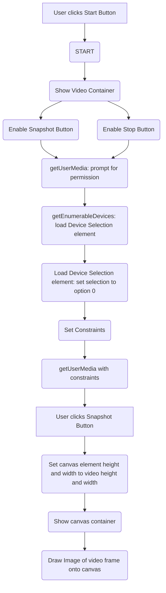
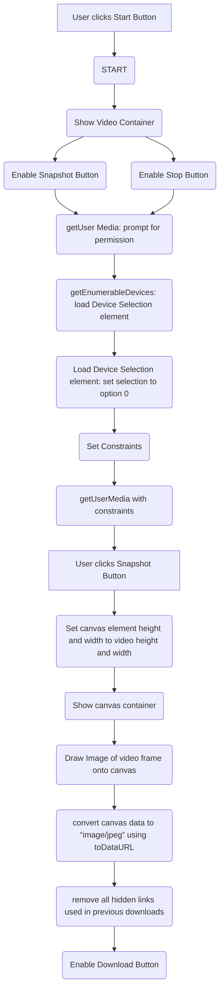
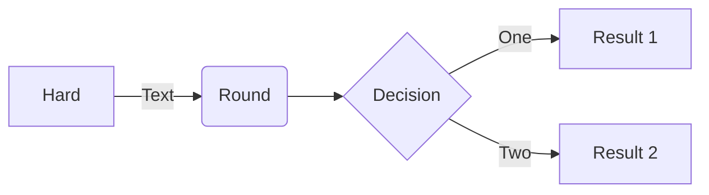

# WebRTC Camera

## Program Flow

```mermaid
flowchart TD

id0[User clicks Start Button] --> id1(START)
id1(START) --> id2(Show Video Container)
id2(Show Video Container) --> id3(Enable Snapshot Button)
id2(Show Video Container) --> id4(Enable Stop Button)
id3(Enable Snapshot Button) --> id5(getUserMedia: prompt for permission)
id4(Enable Stop Button) --> id5(getUserMedia: prompt for permission)
id5(getUserMedia: prompt for permission) --> id6(getEnumerableDevices: load Device Selection element)
id6(getEnumerableDevices: load Device Selection element) --> id7(Load Device Selection element: set selection to option 0)
id7(Load Device Selection element: set selection to option 0) --> id8(Set Constraints based on option 0)
id8(Set Constraints) --> id9(getUserMedia with constraints)
id9(getUserMedia with constraints) --> id10[User clicks Snapshot Button]
id10[User clicks Snapshot Button] --> id11(Set canvas element height and width to video height and width)
id11(Set canvas element height and width to video height and width) --> id12(Show canvas container)
id12(Show canvas container) --> id13(Draw Image of video frame onto canvas)
```

```mermaid
flowchart TD

id0[User clicks Start Button] --> id1(START)
id1(START) --> id2(Show Video Container)
id2(Show Video Container) --> id3(Enable Snapshot Button)
id2(Show Video Container) --> id4(Enable Stop Button)
id3(Enable Snapshot Button) --> id5(getUserMedia: prompt for permission)
id4(Enable Stop Button) --> id5(getUserMedia: prompt for permission)
id5(getUser Media: prompt for permission) --> id6(getEnumerableDevices)
id6(getEnumerableDevices: load Device Selection element) --> id7(Load Device Selection element: set selection to option 0)
id7(Load Device Selection element: set selection to option 0) --> id8(Set Constraints based on option 0)
id8(Set Constraints) --> id9(getUserMedia with constraints)
id9(getUserMedia with constraints) --> id10[User clicks Snapshot Button]
id10[User clicks Snapshot Button] --> id11(Set canvas element height and width to video height and width)
id11(Set canvas element height and width to video height and width) --> id12(Show canvas container)
id12(Show canvas container) --> id13(Draw Image of video frame onto canvas)
id13(Draw Image of video frame onto canvas) --> id14(convert Canvas data to “image/jpeg” using toDataURL)
id14(convert canvas data to “image/jpeg” using toDataURL) --> id15(remove all hidden links used in previous downloads)
id15(remove all hidden links used in previous downloads) --> id16(Enable Download Button)
```

```mermaid
flowchart LR

A[Hard] -->|Text| B(Round)
B --> C{Decision}
C -->|One| D[Result 1]
C -->|Two| E[Result 2]
```

## Credit
Thanks to [IconDuck](https://iconduck.com/icons/33354/photo-camera) for favicon.